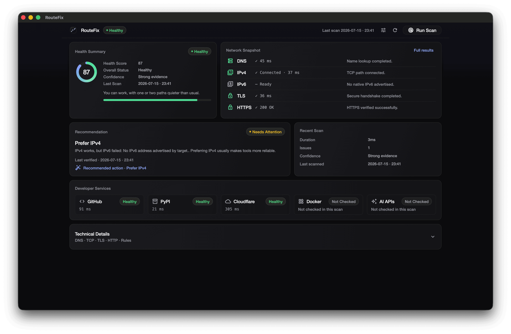
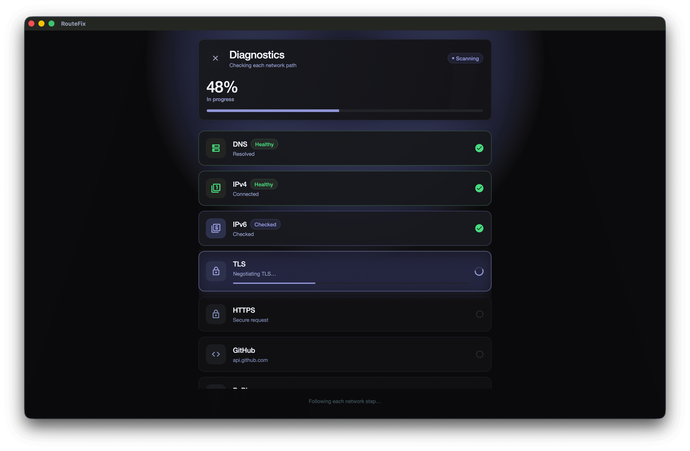
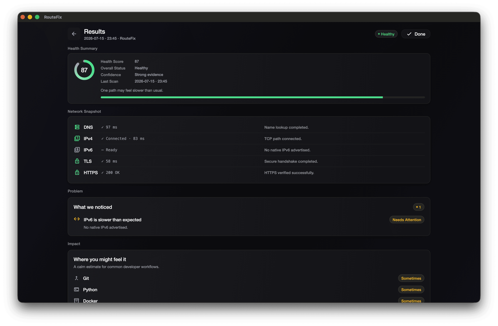
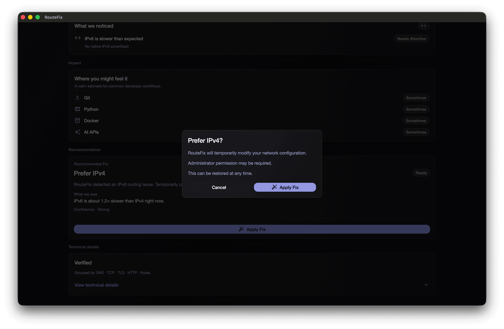

<p align="center">
  
</p>

<h1 align="center">RouteFix</h1>

<p align="center">
  <strong>Diagnose why developer services feel slow — even when your bandwidth is fine.</strong>
</p>

<p align="center">
  <a href="https://github.com/MrHacker26/route-fix/actions/workflows/ci.yml"></a>
  <a href="https://flutter.dev"></a>
  
  
  <a href="LICENSE"></a>
  <a href="https://github.com/MrHacker26/route-fix/releases"></a>
</p>

<p align="center">
  Local desktop app for <em>network routing</em> diagnostics.<br>
  macOS · Windows · Linux · <strong>Not a speed test.</strong>
</p>

<p align="center">
  
</p>

---

## Features

- DNS, IPv4/IPv6, HTTPS, GitHub, PyPI, and Cloudflare probes
- Evidence-gated recommendations (no invented metrics)
- Prefer IPv4 Auto Fix + Restore Defaults (admin required)
- Network Controls for manual IPv6 preference
- Dark Material 3 UI

---

## Install

**Releases:** [GitHub Releases](https://github.com/MrHacker26/route-fix/releases)  
(`RouteFix-v*-macos.zip` / `windows.zip` / `linux.tar.gz`)

**From source:**

```bash
git clone https://github.com/MrHacker26/route-fix.git
cd route-fix
flutter pub get
flutter run -d macos    # or windows / linux
```

```bash
flutter build macos --release
flutter build windows --release
flutter build linux --release
```

Requires Flutter stable with desktop enabled (Dart 3.12+).

---

## Screenshots

| Scanning | Results |
|:--------:|:-------:|
|  |  |

<p align="center">
  
</p>

---

## How it works

1. Probe public endpoints (DNS / TCP / HTTPS)
2. Score health and list issues with evidence
3. Recommend fixes only when confidence is high
4. Optionally apply Prefer IPv4 (admin password required)

---

## Privacy

Runs locally. No telemetry. Traffic only goes to endpoints you diagnose, plus OS commands for Auto Fix.

---

## Contributing

PRs welcome. Keep diagnosis honest — prefer **Unknown** over a wrong fix.

See [`PROJECT.md`](PROJECT.md), [`CHANGELOG.md`](CHANGELOG.md), [`SECURITY.md`](SECURITY.md).

Release: bump version → tag `vX.Y.Z` → push (GitHub Actions publishes binaries).

---

## License

[MIT](LICENSE)
